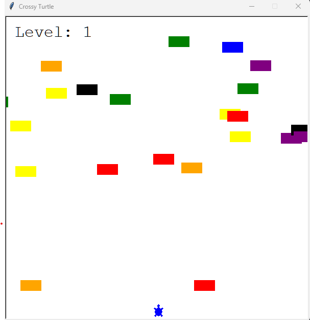

## Turtle Crossing Game [Crossy Road]

This is similar to game [Crossy Road](https://play.google.com/store/apps/details?id=com.yodo1.crossyroad&hl=en&gl=US). We have a swarm of cars racing over a multi-lane highway, and our turtle is the player that needs to cross it.

### Game Play
1. The player takes control of a turtle that must cross a busy highway.
2. When you press the "Up" key or press "Space", a turtle travels forward. 
3. It can only move forward; it cannot move backwards, left, or right.
4. Cars are generated at random along the y-axis and move from the right to the left side of the screen.
5. If the turtle collides with a car, GAME OVER.
6. A level is won if the turtle can cross the street and reach the opposite end.
7. The turtle then returns to its starting location, ready to cross the highway again, but with a higher level of difficulty (as difficulty increases, cars accelerate faster).

### Screenshot

### Refrences
[How to restrict screen resizing](https://stackoverflow.com/questions/48629444/python-turtle-disable-window-resize)
